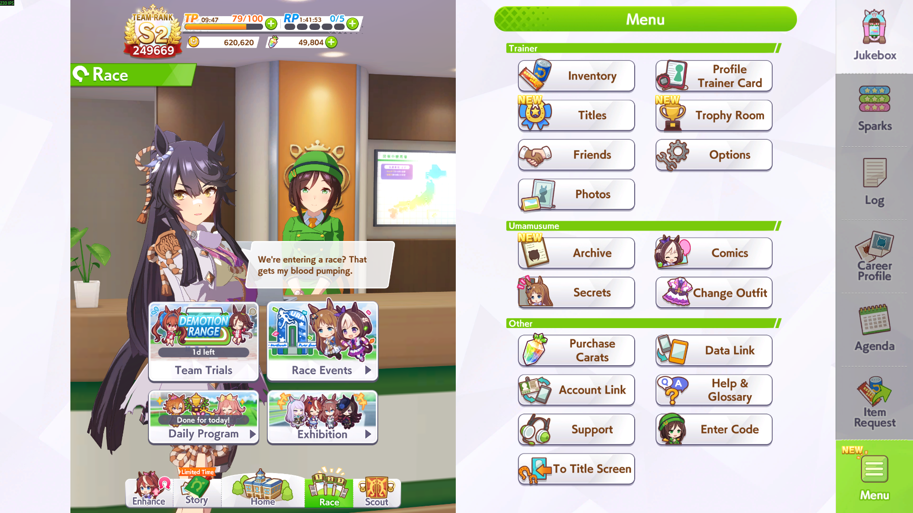
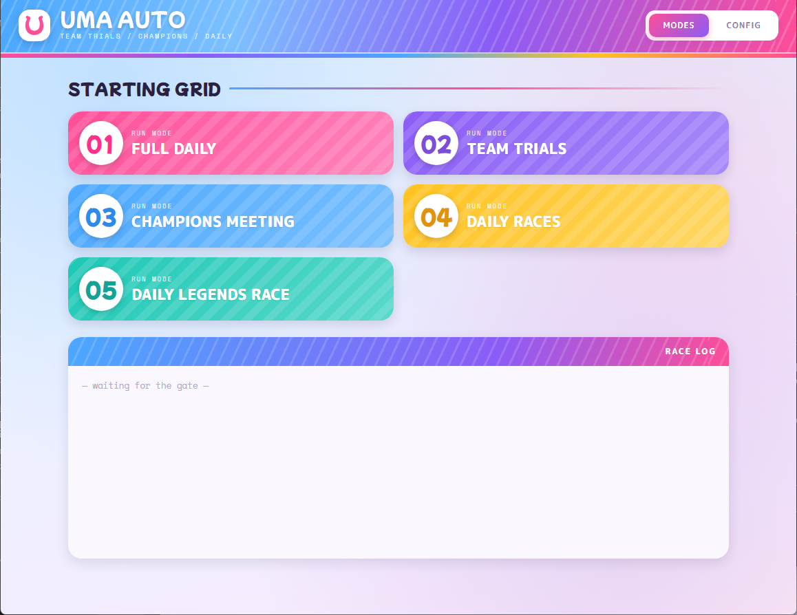
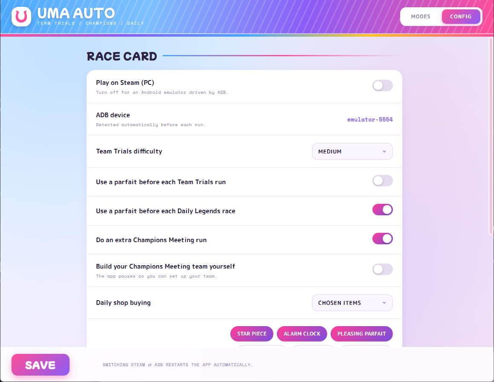

# Uma Musume TT/CM Auto

Automation bot for **Team Trials**, **Champions Meeting**, **Daily Races** and **Daily Legends** in Uma Musume Pretty Derby. Supports both **Android (ADB)** and **PC (Steam)**.

## TL;DR

1. Install **Python 3.10+** (tick _"Add python.exe to PATH"_).
2. Start the game — either your **Android emulator** or **Uma Musume on Steam**.
3. Double-click **`setup.bat`** (first time only — it installs everything and
   makes an **"Uma Auto"** shortcut).
4. Open the **Uma Auto** shortcut → set things up in the **Config** tab → hit a
   mode in the **Modes** tab. Done.

Prefer the terminal? `python
main.py` still works — see [Command line](#command-line-legacy).)\_

## Features

- Automatic Team Trials loop
- Automatic Champions Meeting runs
- Automatic Daily Races (choose reward and difficulty)
- Automatic Daily Legends races (choose the champion)
- Full Daily routine: chains Daily Races → Daily Legends → Team Trials in one click
- Difficulty selection (easy / medium / hard)
- Automatic daily shop purchases: buy **everything**, only a **chosen list** of items, or **nothing**
- Automatic parfait usage
- Dual platform support: Android emulator via ADB or Steam PC

## Prerequisites

- **Python 3.10+**
- **Android (ADB)**: an Android emulator (LDPlayer, BlueStacks, etc.)
- **Steam**: the PC version of Uma Musume

### Emulator / Game Settings

| Platform  | Resolution  | Additional |
| --------- | ----------- | ---------- |
| **ADB**   | 1080 x 800  | 240 DPI    |
| **Steam** | 1920 x 1080 | Fullscreen |

### Python Dependencies

Install everything from `pyproject.toml` (recommended):

```bash
pip install -e .
```

Or install the packages by hand:

```bash
pip install pillow opencv-python numpy pyautogui pygetwindow pywin32
```

## Before Starting

You no longer need to be on a specific screen: the bot works from the **Home**
screen **or** the **Race Menu**. Each mode navigates back to Race on its own
before it starts, so either one is fine.

> **Daily Races & Daily Legends:** you must have completed each of these at
> least **once manually** before letting the bot run them. The first manual run
> clears the intro/tutorial screens and unlocks the normal race flow the bot
> relies on. This also applies to the **Full Daily** mode, which chains them.




## Configuration

### `config.json`

| Key                         | Description                                                                      |
| --------------------------- | -------------------------------------------------------------------------------- |
| `steam`                     | `true` for Steam PC mode, `false` for ADB mode                                   |
| `steam_window_title`        | Steam window title (e.g. `"umamusume"`)                                          |
| `device_id`                 | ADB device ID (e.g. `"emulator-5556"`)                                           |
| `difficulty_tm`             | Team Trials difficulty: `"easy"`, `"medium"` or `"hard"`                         |
| `daily_sales_mode`          | Daily shop: `"all"` (buy everything), `"specific"` (buy `shop_items`) or `"off"` |
| `shop_items`                | Item names to buy when `daily_sales_mode` is `"specific"` (see list below)       |
| `use_parfait_TT`            | Use a parfait before each Team Trials run                                        |
| `use_parfait_daily_legends` | Use a parfait before each Daily Legends race                                     |
| `cm_extra_run`              | Do one extra Champions Meeting run                                               |
| `make_your_own_team`        | Use your own CM team instead of the auto-selected one                            |
| `daily_race_difficulty`     | Daily Races difficulty: `"easy"`, `"normal"`, `"hard"` or `"very_hard"`          |
| `daily_race_reward`         | Daily Races reward to farm: `"money"` or `"support"`                             |
| `daily_legends_champion`    | Daily Legends champion to race against (e.g. `"Special Week"`)                   |

When `daily_sales_mode` is `"specific"`, `shop_items` accepts any of:
`"Star Piece"`, `"Alarm Clock"`, `"Pleasing Parfait"`, `"Sprint Shoes"`,
`"Mile Shoes"`, `"Medium Shoes"`, `"Long Shoes"`, `"Dirt Shoes"`,
`"Support Points"`, `"Sash"`.

## Usage

There are **two ways** to run the bot — pick whichever you prefer:

- **Uma Auto** — the graphical app (recommended). Double-click the shortcut, no
  console needed.
- **Legacy CLI** — the original `main.py`, driven from a terminal/`cmd`. Same
  features, text-menu only.

Both share the same `config.json` and the same automation, so you can switch
between them at any time.

### Graphical app (recommended)

Run **`setup.bat`** once. It installs everything automatically (about a minute)
and creates an **"Uma Auto" shortcut in this folder**. From then on, just
double-click that shortcut: it opens the app **with no console window at all** —
no need to run `setup.bat` again. Because it runs plain Python (never a packaged
`.exe`), antivirus software does **not** flag it as a virus.

> The shortcut points to `pythonw.exe -m umauto.gui` with absolute paths, so it
> is machine-specific (not committed to git). If you move the project folder,
> run `setup.bat` again to recreate it.

The window has two tabs — **Modes** and **Config**.



**Modes** — the _Starting Grid_ lists one card per game mode; click a card to run
it. The _Race Log_ underneath streams the bot's progress live, and a **Stop**
button aborts the current run. A mode that needs input (e.g. how many Champions
Meeting runs you have already done) pops up a small dialog.



**Config** — the _Race Card_ form edits every `config.json` option (toggles,
dropdowns, item chips). Click **Save** to apply. On a fresh install the app opens
here first, so you can set everything up graphically instead of the text wizard.

How settings take effect:

- Most options apply on the **next run**.
- **Switching Steam ⇄ ADB restarts the app automatically** (the whole
  game-control layer is rebuilt).
- **"Keep the app window on top"** (Steam only) applies **instantly**.

On **Steam** with _Keep on top_ enabled, the window floats over the game and
snaps to a preset spot while a mode runs, then returns to its place afterwards —
handy on a fullscreen game's letterbox bar. On **ADB**, the connected emulator is
detected (and saved) automatically before each run.

Prefer to run it without the `.bat`:

```bash
pip install -e ".[gui]"
python -m umauto.gui
```

### Command line (legacy)

The original terminal version still works exactly as before — use it if you
prefer the `cmd` output or want to run without the GUI.

1. Make sure the game is on the **Home** screen or the **Race Menu**
2. Run the bot:

```bash
python main.py
# or, as a package:
python -m umauto
```

On the **first run**, if `config.json` is missing, a short wizard asks for your
platform and preferences and generates it for you. You can also copy
`config.example.json` to `config.json` and edit it by hand.

3. Choose a mode:
   - `[1]` Full Daily (Daily Races + Daily Legends + Team Trials)
   - `[2]` Team Trials
   - `[3]` Champions Meeting
   - `[4]` Daily Races
   - `[5]` Daily Legends Race
   - `[0]` Exit

> **ADB devices** are detected automatically before each run: the app picks the
> connected emulator, updates `config.json` if its id changed, and only asks you
> to choose when several devices are connected with nothing configured yet.

## Project Structure

The code lives in `src/umauto`, laid out **feature-first** (one folder per game
mode) on top of a small shared core. Each file does **one thing**, so a mode
reads as a short list of steps and its `runner.py` just wires them together.

```
src/umauto/
├── app.py            # entry point: run the wizard, then the menu
├── cli.py            # interactive menu that dispatches to a mode
├── config.py         # read-only view over config.json
├── coords.py         # merges coords/*.json into one lookup (per-feature files)
├── screen.py         # semantic screen actions (tap "home", wait "in_shop"...)
├── paths.py          # resolve files relative to the project root
│
├── driver/           # platform backends behind one interface
│   ├── base.py       #   shared image/colour matching
│   ├── adb.py        #   Android emulator (adb)
│   └── steam.py      #   Steam PC window (pyautogui/win32)
│
├── setup/            # first-run config wizard
│   ├── defaults.py   #   default values + option lists
│   ├── prompts.py    #   input() helpers (yes/no, choice, list...)
│   └── wizard.py     #   ask the questions, write config.json
│
├── gui/              # native graphical front-end (pywebview)
│   ├── app.py        #   open the window over web/index.html
│   ├── schema.py     #   config fields for the settings form
│   ├── runtime.py    #   run a feature in a thread; log + prompt redirection
│   ├── api.py        #   methods exposed to the HTML page
│   └── web/          #   index.html (the interface itself)
│
└── features/         # one folder per mode, one file per action
    ├── team_trials/      launch · setup · difficulty · run · finish · runner
    ├── champions_meeting/ launch · run · reward · team · ticket · runner
    ├── daily_races/      launch · select · start · race · runner
    ├── daily_legends/    launch · select · race · champions · runner
    ├── daily_full/       runner (chains the three dailies)
    └── shop/             mode · buy_all · buy_specific · dispatch · shop_items
```

Adding a mode is a matter of dropping a new `features/<mode>/` folder (action
files + a `runner.py`) and wiring it into `cli.py`.
