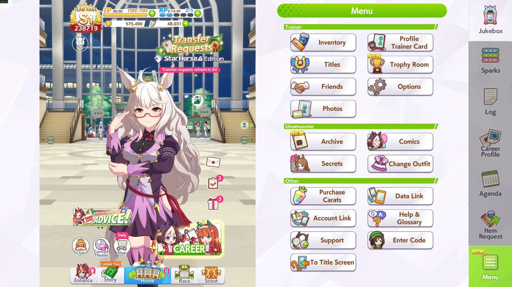

# Uma Musume TT/CM Auto

Automation bot for **Team Trials** and **Champions Meeting** in Uma Musume Pretty Derby. Supports both **Android (ADB)** and **PC (Steam)**.

## Features

- Automatic Team Trials loop
- Difficulty selection (easy / medium / hard)
- Automatic daily shop purchases (configurable per item)
- Automatic parfait usage
- Dual platform support: Android emulator via ADB or Steam PC

## Prerequisites

- **Python 3.10+**
- **Android (ADB)**: an Android emulator (LDPlayer, BlueStacks, etc.)
- **Steam**: the PC version of Uma Musume

### Emulator / Game Settings

| Platform | Resolution | Additional |
|----------|-----------|------------|
| **ADB** | 1080 x 800 | 240 DPI |
| **Steam** | 1920 x 1080 | Fullscreen |

### Python Dependencies

```bash
pip install Pillow pyautogui pygetwindow matplotlib pywin32
```

## Before Starting

Make sure the game is on the **Race Menu** screen before launching the bot:



## Configuration

### `config.json`

| Key | Description |
|-----|-------------|
| `steam` | `true` for Steam PC mode, `false` for ADB mode |
| `steam_window_title` | Steam window title (e.g. `"umamusume"`) |
| `device_id` | ADB device ID (e.g. `"emulator-5556"`) |
| `difficulty_tm` | Team Trials difficulty: `"easy"`, `"medium"` or `"hard"` |
| `daily_sales_buy` | Auto-buy from the daily shop |
| `alarm_clocks` | Buy alarm clocks |
| `stars_pieces` | Buy star pieces |
| `pleasing_parfait` | Buy pleasing parfaits |
| `support_points` | Buy support points |
| `racing_shoes` | Buy racing shoes |
| `sashes` | Buy sashes |
| `use_parfait` | Use a parfait before each run |

## Usage

1. Make sure the game is on the **Race Menu** (see screenshot above)
2. Run the bot:

```bash
python main.py
# or, as a package:
python -m umauto
```

On the **first run**, if `config.json` is missing, a short wizard asks for your
platform and preferences and generates it for you. You can also copy
`config.example.json` to `config.json` and edit it by hand.

3. Choose a mode:
   - `[1]` Team Trials
   - `[2]` Champions Meeting
   - `[0]` Exit

## Helper Tools
To check connected ADB devices:

```bash
python check_device.py
```
